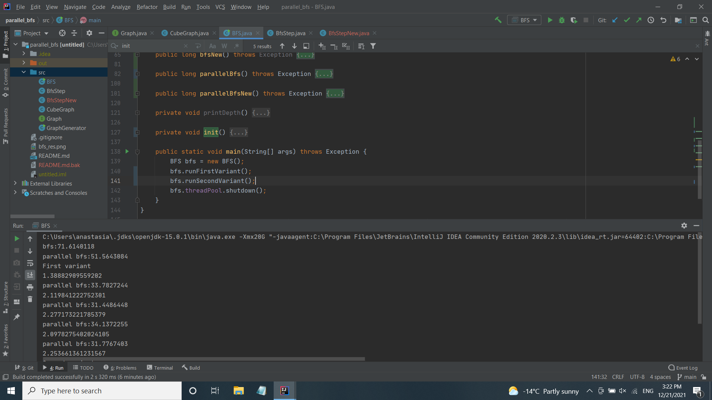
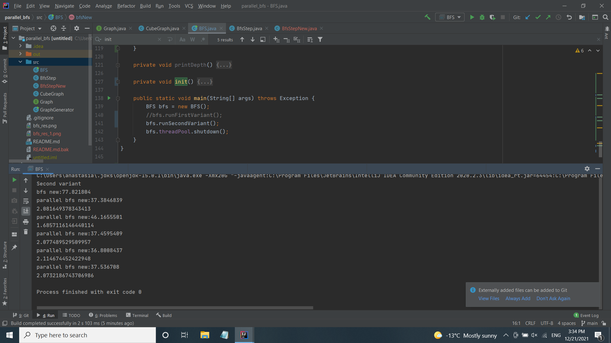

# parallel_bfs
(запуск BFS#main с флагом -Xmx20G)\
\
**Результаты:**\
First variant\
bfs: 71s\
parallel bfs: 51s\
1.38\
parallel bfs: 33s\
2.11\
parallel bfs: 31s\
2.27\
parallel bfs: 34s\
2.09\
parallel bfs: 32s\
2.25\
\
Second variant\
bfs new: 77s\
parallel bfs new: 37s\
2.08\
parallel bfs new: 46s\
1.68\
parallel bfs new: 37s\
2.07\
parallel bfs new: 36s\
2.11\
parallel bfs new: 37s\
2.07\

