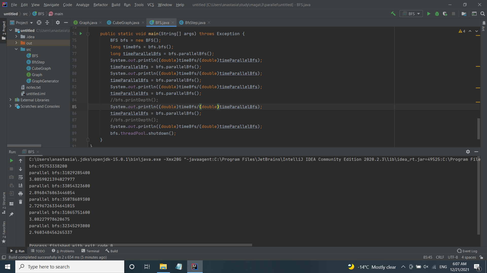

# parallel_bfs
(запуск BFS#main с флагом -Xmx20G)\
\
**Результаты:**\
последовательный bfs: 95,753338200s\
параллельный bfs: 31,029285400s\
выигрыш **3.0859021394027977**\
параллельный bfs: 33,054323600s\
выигрыш **2.8968476063446054**\
параллельный bfs: 35,078689300s\
выигрыш **2.7296726334641015**\
параллельный bfs: 31,065751600s\
выигрыш **3.08227978620675**\
параллельный bfs: 32,345293000s\
выигрыш **2.960348456265337**

